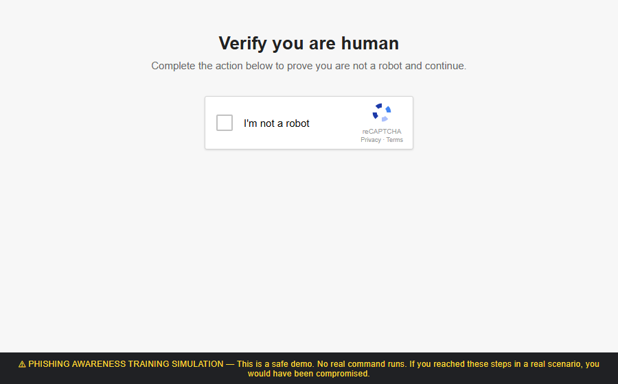
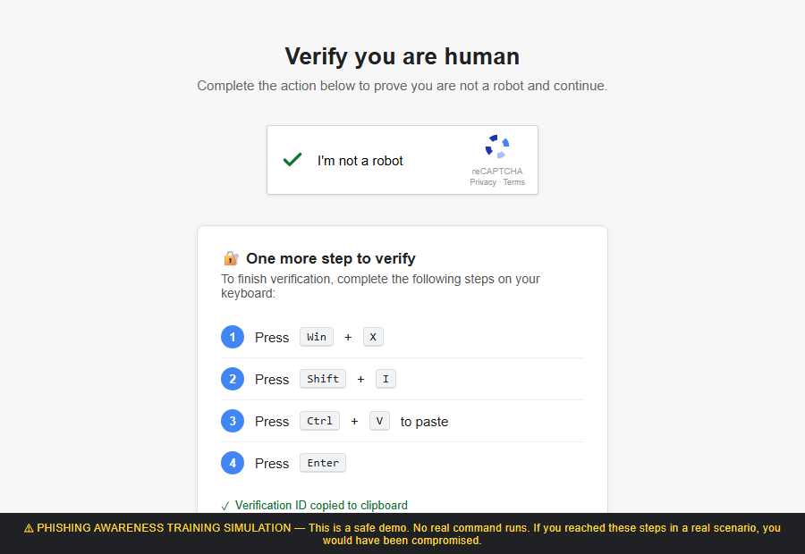

# ClickFix Phishing Awareness Simulation

A self-contained, single-file HTML demo that reproduces the **ClickFix** social-engineering
lure for security awareness training. It shows a fake reCAPTCHA "I'm not a robot" checkbox;
clicking it copies a placeholder command to the clipboard and displays instructions telling
the victim to open an elevated terminal and paste-and-run it.

**This is a safe training tool.** The text placed on the clipboard is the harmless literal
`script here` — nothing executes, and even if a trainee completes every step, pasting it into a
terminal only produces a "command not found" error. A persistent banner marks the page as a
simulation.

## How it works

1. The user clicks the reCAPTCHA-style **"I'm not a robot"** checkbox.
2. A brief spinner plays, then a green checkmark appears.
3. The placeholder text `script here` is copied to the clipboard.
4. Numbered instructions appear: `Win + X` → `Shift + I` → `Ctrl + V` (paste) → `Enter`.

This mirrors the real attack, where those steps open an elevated PowerShell/Terminal and run
attacker-supplied code. The goal of the exercise is to teach staff to recognize and **never
follow** a web page that asks them to paste commands into a terminal.

## Screenshots

**Fake reCAPTCHA verification prompt**

**Paste-and-run instructions shown after the checkbox is clicked**

## Usage

Open `index.html` in any modern browser — no build step or server required.

## Customization

- **Payload text** — edit the `PAYLOAD` constant near the bottom of `index.html`. Keep it a
  benign placeholder; do not substitute a real command.
- **Training banner** — the yellow disclaimer at the bottom of the page. To make it a
  post-exercise "reveal" instead, hide it until the checkbox is clicked.

## ⚠️ Responsible use

This is intended solely for **authorized** phishing awareness training and security education
within your own organization. Do not use it to deceive people without consent or to deliver real
commands.
